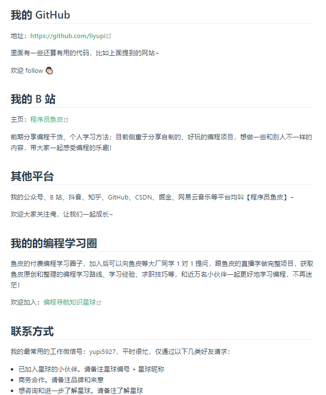

github导学视频:

https://www.bilibili.com/video/BV1KZ4y1e7cG/?spm_id_from=333.337.search-card.all.click&vd_source=e3c1a57c5f8561699e8f4460cc5ae27d

# 鱼皮资源

是什么?有啥用?为啥学?

git和github是为协作开发而生的

git是linux之父为为更好的管理linux内核而开发创立的

git是分布式版本控制系统

github是代码托管平台

利用git工具将代码上传到平台进行管理

github是开源的,但是公司为了安全会有自己的代码托管平台

在github平台可以共享代码和免费学习和参与项目

大多数公司用其管理项目,不得不学

啥时候学?

有编程基础后,开发项目前,可以将代码放到github管理

学哪些?重点哪些?咋学?有啥方法和资源？

鱼皮编程导航知识星球:

https://yupi.icu/

四个学习阶段:

git基础

猴子都能懂的git入门:

https://backlog.com/git-tutorial/cn/intro/intro1_1.html

git学习可视化在线游戏:

https://learngitbranching.js.org/?locale=zh_CN

github基础

github官方文档教程

https://docs.github.com/cn/get-started

github漫游指南

https://github.phodal.com/#/chapter/Github%E6%BC%AB%E6%B8%B8%E6%8C%87%E5%8D%97

开源指北

https://oschina.gitee.io/opensource-guide/guide/%E7%AC%AC%E4%B8%80%E9%83%A8%E5%88%86%EF%BC%9A%E5%88%9D%E8%AF%86%E5%BC%80%E6%BA%90/%E7%AC%AC%201%20%E5%B0%8F%E8%8A%82%EF%BC%9A%E4%BB%80%E4%B9%88%E6%98%AF%E5%BC%80%E6%BA%90/

git进阶

git官方文档

https://git-scm.com/doc

github进阶

面试考吗,概率很低

github学习路线:

https://yupi.icu/%E6%98%9F%E7%90%83%E8%B5%84%E6%96%99/%E5%AD%A6%E4%B9%A0%E8%B7%AF%E7%BA%BF.html#git-github-%E5%AD%A6%E4%B9%A0%E8%B7%AF%E7%BA%BF

鱼皮github:

https://github.com/liyupi

# B站视频

『教程』一看就懂！Github基础教程

https://www.bilibili.com/video/BV1hS4y1S7wL/?spm_id_from=333.337.search-card.all.click&vd_source=e3c1a57c5f8561699e8f4460cc5ae27d

# 资源

中文社区:

https://www.githubs.cn/

