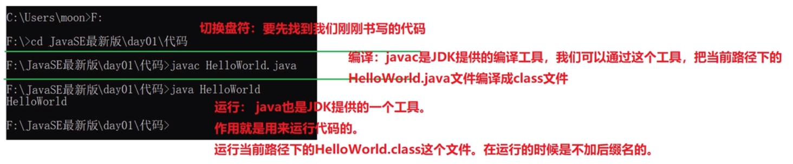

# 计算机语言排行榜

网址:

https://www.tiobe.com/tiobe-index/


# java历史与背景

java语言的发展教程黑马:

https://www.bilibili.com/video/BV17F411T7Ao?p=12&vd_source=e3c1a57c5f8561699e8f4460cc5ae27d

java8,java11,java17是LTS长期支持版本


java能干嘛教程黑马:

https://www.bilibili.com/video/BV17F411T7Ao?p=13&vd_source=e3c1a57c5f8561699e8f4460cc5ae27d


平台:javaEE,javaSE,javaME(ME凉掉了)


游戏领域桌面应用不占优势

javaEE,最牛的是浏览器+服务器

桌面应用:各种管理软件

企业级应用,大流量,

移动应用,嵌入式开发

科学计算的软件

大数据开发的软件


诞生发展与至今

SUN(Stanford University Network，斯坦福大学网络公司 ) 1995年推出

java之父James Gosling

oracle公司


java三大平台:

javaSE,javaEE,javaME


java应用方向:

企业级应用,Android平台应用,大数据平台开发(各类框架有Hadoop，spark，storm，flink等)


# java语言特点

面向对象

跨平台性

多线程

分布式

......


# java学习路线

​	参考java学习导航Xmind文档


# java环境搭建

​	参考环境搭建md文档


# CMD命令

## 打开cmd方式

方式一:

​	wim + r 出现运行窗口

​	在运行窗口里面输入 cmd 回车

方式二:

文件夹路径上点击路径,cmd回车


## 常用命令

切换盘符

> 盘符名称 + 冒号

列出当前目录下的文件及文件夹

> dir

创建目录

> md +文件夹名称

进入单级文件夹

> cd + 文件夹名称

回退单级文件夹

> cd..

进入多级文件夹

> cd + 文件夹名称1/文件夹名称2/...

直接退到盘符

> cd\

清屏

> cls

退出

> exit

打开文件

> 文件夹+后缀名

删除文件

> del

删除层级关系很深的文件夹

> rd 文件夹 /s 


## cmd命令大全

常用CMD命令大全:https://blog.csdn.net/qq_49488584/article/details/122609779


# jdk安装和配置

目前安装使用java1.8.0_333版本

​	JDK的安装和环境配置
​		Jdk帮助文档官网:https://www.oracle.com/cn/java/technologies/java-se-api-doc.html

?:https://www.oracle.com/java/technologies/java-readme.html

## jdk下载和安装和配置

卸载JDK:

直接找到jdk安装位置,直接删除

然后清理环境变量,删除JAVA_HOME和path

官网下载https://www.oracle.com/java/technologies/downloads/#java8-windows

jdk下载安装配置教程狂神:https://www.bilibili.com/video/BV12J41137hu?p=17

​												:https://www.bilibili.com/video/BV1Cv411372m?p=8

有安装包就直接安装

(参考安装文档)

关于javac不能用的问题

参考社区解决办法或者

> C:\Program Files\Common Files\Oracle\
>
> 将以上路径中的java文件删除

推介使用==LTS版本,长期支持版==

老版本,Path环境变量需要手动配置,目的就是可以方便在命令行窗口的任意目录启动程序

新版本jdk自动配置Path环境变量,但是JAVA_HOME还是要手动配置

%%的目的就是只需要维护JAVA_HOME,jdk版本改变,不需要改变Path


## jdk安装目录

bin:该路径下存放了各种工具命令,其中比较重要的就是javac编译工具和java执行命令

conf:改路径下存放了相关配置文件

include:该路径下存放了一些平台特定的头文件

jmods:改路径下存放了各种模块

legal:该路径下存放了各模块的授权文档

lib:该路径下存放了工具的一些补充jar包


## 配置环境变量

jdk17自动在环境变量中配置了路径

C:\Program Files\Common Files\Oracle\Java\javapath但是只配置了java,javac,等四个工具,其他没有配置

配置JAVA_HOME和Path教程黑马:

https://www.bilibili.com/video/BV17F411T7Ao?p=10&spm_id_from=pageDriver&vd_source=e3c1a57c5f8561699e8f4460cc5ae27d


测试环境

打开命令行窗口 javac 回车就会显示编译器详细信息,则配置成功

或者 java -version

## win10环境变量

打开环境变量设置:

右键单击我的电脑 --> 属性 --> 高级系统设置 --> 高级 --> 环境变量 -->系统变量新建 --> 输入路径 --> 保存

用户变量不用管,是记录用户的

作用:记录文件路径,简化打开方式


# java跨平台原理

java跨平台原理教程黑马:

https://www.bilibili.com/video/BV17F411T7Ao?p=15&vd_source=e3c1a57c5f8561699e8f4460cc5ae27d

C编译型,整体翻译

Python解释型,用一行翻译一行

java混合型

不同操作系统有对应的jvm,在jvm中运行java代码

java程序 --> java虚拟机 --> 操作系统 --> 计算机硬件


# java程序运行机制

java源文件 --> 编译器 --> .class文件 --> 解释器 --> 计算机 


# JRE和JDK

JRE和JDK关系黑马:

https://www.bilibili.com/video/BV17F411T7Ao?p=16&spm_id_from=pageDriver&vd_source=e3c1a57c5f8561699e8f4460cc5ae27d

JRE是对JDK的抽离,当编写好代码编译成class文件,放到别人电脑中运行,很多工具用不到,并不需要完整的jdk进行支持,为了省空间,直接从jdk抽离出JRE运行时环境支持运行class文件即可


# 计算机存储规则

计算机中的数据储存黑马:

https://www.bilibili.com/video/BV17F411T7Ao?p=22&spm_id_from=pageDriver&vd_source=e3c1a57c5f8561699e8f4460cc5ae27d

文本--数字,字母,汉字

图片

声音

视频=图片+声音

计算机中,任意数据都是二进制存储

十进制,逢十进一,借一当十

二进制,逢二进一,借一当二


有个二进制玩具可以直观看二进制进位


不同进制在代码中的表现形式


1958年打孔机

现在5v的电路板,大于3.3V的就是1,小于3.3V的就是0


## 进制转换

任意进制转十进制

十进制转任意进制

使用计算机的计算器进行转换就行

8421快速转换法:二进制快速转换十进制

除基取余法:十进制转换任意进制

## 码表

ASCII码表对应存储规则  --> 针对英语

GB2312 --80年代

GBK是统一湾湾的码表

Unicode万国码,包含其他大部分国家的语言

### ASCII码表概念

计算机是一个二货,存储到计算机中的所有内容,都需要转换成二进制存储。

如果向计算机中存储字符数据也不例外，需要把字符转换成二进制的0和1进行存储。

 

思考： 如何把字符转换成二进制数据进行存储呢？

​    查看ASCII编码表

 

ASCII编码表：就是存储字符和数字对应关系的一张表格。（相当于字典：汉字和拼音）

 ASCII码表解决了字符在计算机中的存储

1.存储字符时：

​    需要查找ASC码表,找到字符对应的数字,将数字转换为二进制数存放到计算机中

​    

​    'A' --> ASC码表 --> 65 --> 1000001 大写字母是连续的,对应的ASCII码值依次+1

​    'a' --> ASC码表 --> 97 --> 1100001 小写字母是连续的,对应的ASCII码值依次+1

​    '0' --> ASC码表 --> 48 --> 110000  数字字符是连续的,对应的ASCII码值依次+1

​    

2.使用字符时：

​    将对应的二进制数转换为十进制 找到ASCII表中对应的字符 显示出来

​    1000001 --> 65 --> ASC码表 --> 'A'

​    1100001 --> 97 --> ASC码表 --> 'a'

​    110000  --> 48 --> ASC码表 --> '0' 


### ASCII码表

| ASCII值 | 控制字符 | ASCII值 | 控制字符 | ASCII值 | 控制字符 | ASCII值 | 控制字符 |
| ------- | -------- | ------- | -------- | ------- | -------- | ------- | -------- |
| 0       | NUT      | 32      | (space)  | 64      | @        | 96      | 、       |
| 1       | SOH      | 33      | ！       | **65**  | A        | **97**  | a        |
| 2       | STX      | 34      | ”        | 66      | B        | 98      | b        |
| 3       | ETX      | 35      | #        | 67      | C        | 99      | c        |
| 4       | EOT      | 36      | $        | 68      | D        | 100     | d        |
| 5       | ENQ      | 37      | %        | 69      | E        | 101     | e        |
| 6       | ACK      | 38      | &        | 70      | F        | 102     | f        |
| 7       | BEL      | 39      | ,        | 71      | G        | 103     | g        |
| 8       | BS       | 40      | (        | 72      | H        | 104     | h        |
| 9       | HT       | 41      | )        | 73      | I        | 105     | i        |
| 10      | LF       | 42      | *        | 74      | J        | 106     | j        |
| 11      | VT       | 43      | +        | 75      | K        | 107     | k        |
| 12      | FF       | 44      | ,        | 76      | L        | 108     | l        |
| 13      | CR       | 45      | -        | 77      | M        | 109     | m        |
| 14      | SO       | 46      | .        | 78      | N        | 110     | n        |
| 15      | SI       | 47      | /        | 79      | O        | 111     | o        |
| 16      | DLE      | **48**  | 0        | 80      | P        | 112     | p        |
| 17      | DCI      | 49      | 1        | 81      | Q        | 113     | q        |
| 18      | DC2      | 50      | 2        | 82      | R        | 114     | r        |
| 19      | DC3      | 51      | 3        | 83      | X        | 115     | s        |
| 20      | DC4      | 52      | 4        | 84      | T        | 116     | t        |
| 21      | NAK      | 53      | 5        | 85      | U        | 117     | u        |
| 22      | SYN      | 54      | 6        | 86      | V        | 118     | v        |
| 23      | TB       | 55      | 7        | 87      | W        | 119     | w        |
| 24      | CAN      | 56      | 8        | 88      | X        | 120     | x        |
| 25      | EM       | 57      | 9        | 89      | Y        | 121     | y        |
| 26      | SUB      | 58      | :        | 90      | Z        | 122     | z        |
| 27      | ESC      | 59      | ;        | 91      | [        | 123     | {        |
| 28      | FS       | 60      | <        | 92      | /        | 124     | \|       |
| 29      | GS       | 61      | =        | 93      | ]        | 125     | }        |
| 30      | RS       | 62      | >        | 94      | ^        | 126     | ~        |
| 31      | US       | 63      | ?        | 95      | —        | 127     | DEL      |

 

| NUL 空        | VT 垂直制表    | SYN 空转同步        |
| ------------- | -------------- | ------------------- |
| SOH 标题开始  | FF   走纸控制  | ETB  信息组传送结束 |
| STX  正文开始 | CR   回车      | CAN  作废           |
| ETX  正文结束 | SO   移位输出  | EM   纸尽           |
| EOY  传输结束 | SI    移位输入 | SUB  换置           |
| ENQ  询问字符 | DLE  空格      | ESC  换码           |
| ACK  承认     | DC1  设备控制1 | FS   文字分隔符     |
| BEL  报警     | DC2  设备控制2 | GS   组分隔符       |
| BS   退一格   | DC3  设备控制3 | RS   记录分隔符     |
| HT   横向列表 | DC4  设备控制4 | US   单元分隔符     |
| LF   换行     | NAK  否定      | DEL  删除           |

最后一次更新则是在1986年，到目前为止共定义了128个字符


## 图片存储

黑白图,就是简单的01,白就是1,黑就是0

灰度图,0-255表示灰度数据


就是一个渐变色,0是纯黑,255是纯白

不同值代表不同颜色

彩色图


分辨率,就是显示器的分辨率

像素,每一个小格子组成,每个小格子就是像素

三原色:美学三原色红黄蓝

​				光学三原色红绿蓝

每个颜色可以看成多少分三原色的组合

纯红,纯绿,纯蓝

计算机采用光学三原色:RGB代表三原色

可以写成十进制,也可以写成十六进制

彩色图的原理,就是每个像素搭配不同三原色组成的


## 声音存储


每个点都有数字对应

高音质就是采集的点比较多,记录的数据也多


# idea

黑马教程:

https://www.bilibili.com/video/BV17F411T7Ao?p=27&vd_source=e3c1a57c5f8561699e8f4460cc5ae27d


# 入门程序HelloWord

老版本需要先配置环境变量,新版本直接使用

使用Notepad++/记事本编写以下代码保存

```java
public class HelloWorld{
	public static void main(String[] args){
		System.out.println("Hello,World!");
	}
}
```

在文件所在处使用dos命令编译文件

> javac HelloWorld.java

使用命令运行文件

> java HelloWorld

java11开始支持java直接运行源代码文件

命令

> java HelloWord.java

底层先生成一个临时的class文件,文件夹不会显示

解释:



三步:

编写程序,编译文件,运行程序


## bug:

识别bug:多看,看自己的代码,看别人的代码

分析bug:多思考,多查资料,

解决bug:多尝试,多总结


## 常见问题


# 注释

单行

多行注释:多数情况下使用多行注释

文档注释:

类的文档注释,类中成员的文档注释,类成员方法的文档注释

有趣的注释:

https://blog.csdn.net/ydk888888/article/details/81563608

在线生成器:

https://www.bootschool.net/chinese-to-ascii

http://patorjk.com/software/taag/#p=display&f=Graffiti&t=Type%20Something%20

http://www.network-science.de/ascii/

```txt
      ##           # # # # ##     
       ###         ### ### #####  
   #    #     #    # # # # #   #  
  ##############   # # # ## ## #  
 ###         ##    # # # # ## ##  
  #          #     ### ### ##  #  
              #    # # # # ## #   
  ##############   # # # # ###### 
        ##         # # # # #   ## 
        ##         ### ###     ## 
        ##         # # # #     ## 
        ##         # # # # ###### 
        ##         # # # ####  ## 
        ##         # # # #     ## 
      ####        #  # # #    ### 
        #         # # # #      #  
```


# 标识符与分隔符

一切起名字的地方,具体包括常量名,变量名,枚举名,方法名,类名,接口名,包名

起名字时需要遵守规则和规范,见名知意原则

命名规则:(参考阿里巴巴开发手册)


# 关键字与保留字

关键字含义

参考:

https://docs.oracle.com/javase/tutorial/java/nutsandbolts/_keywords.html

goto和const作为保留字存在,目前并不使用

# 字面量

数据在程序中的书写格式

字面量不是常量!!!
字面量就是字面值!!!


## 转义字符

转移字符对应的英文是escape character  , 转义字符串（Escape Sequence）

字母前面加上捺斜线"\"来表示常见的那些不能显示的ASCII字符.称为转义字符.如\0,\t,\n等，就称为转义字符，因为后面的字符，都不是它本来的ASCII字符意思了。

所有的转义字符和所对应的意义：

## 转义字符含义

| 转义字符 | 意义                                | ASCII码值（十进制） |
| -------- | ----------------------------------- | ------------------- |
|          |                                     |                     |
| \b       | 退格(BS) ，将当前位置移到前一列     | 008                 |
| \f       | 换页(FF)，将当前位置移到下页开头    | 012                 |
| \n       | 换行(LF) ，将当前位置移到下一行开头 | 010                 |
| \r       | 回车(CR) ，将当前位置移到本行开头   | 013                 |
| \t       | 水平制表(HT) （跳到下一个TAB位置）  | 009                 |
| \v       | 垂直制表(VT)                        | 011                 |
| \\       | 代表一个反斜线字符''\'              | 092                 |
| \'       | 代表一个单引号（撇号）字符          | 039                 |
| \"       | 代表一个双引号字符                  | 034                 |
| \0       | 空字符(NULL)                        | 000                 |
| \ddd     | 1到3位八进制数所代表的任意字符      | 三位八进制          |
| \uhhhh   | 1到2位十六进制所代表的任意字符      | 二位十六进制        |
| \uxxxx   | 4位十六进制数据所表示的字符         | 如\u0052            |

注意：区分，斜杠："/" 与 反斜杠："\" ,此处不可互换

将转义字符赋值给字符变量时,与字符常量值一样需要使用单引号.

 

## /斜线与\反斜线区别(撇和捺的区别)

① / 斜线， slash或又称为forward slash （前斜线）， 原本是标点符号。 起源于古罗马，中世纪时用作逗号（而当时的双斜线//是被当作连接号的，后来演化成等号=）。

　　a) 英语里的斜线， 最常用的即使替代字符“or”表选择， 比如： Yes/No； 还有就是避免名字的冲突，比如美国的人口普查表中有"Assyrian/Chaldean/Syriac"， 就是为了避免因Syriac名字不同叫法而产生的冲突或歧义，其实也是or的含义；

　　b) 算术； 英文里面称over， 比如： 123/456，也即分数
　　c) 金钱表示。 $50/- 表示50美元上限， 后面没有了，防止有人添加修改。

　　d) 日期的表示

② \ backslash, 反斜线， 主要用于电脑中， 也正是对普通/斜线的借鉴。 操作系统（xNix）， 电脑语言（C/C++, Perl），编码（部分Unicode）等都使用它。


# 常量


# 变量

## 变量的定义格式

变量是程序中最基本的存储单元。包含变量类型、变量名和存储的值

```
数据类型 变量名 = 变量值;
```


## 变量的赋值


## 变量的作用域


## 变量的存储


# 数据类型

## 基本数据类型

四类八种

byte,short,int,long  -->  1,2,4,8

float,double  -->  4,8

char  --> 2

boolean --> true,false

null

float和int都是4个字节,但是范围比long还大为什么?

浮点数的精度问题


## 引用数据类型

类,接口,数组


# 类型转换

## 自动类型提升

byte、short、char --> int --> long --> float --> double

特别的:当byte,short,char类型变量做运算时,结果为int


## 强制类型转换


# 运算符

## 算术运算符


### 一元运算


### 二元运算


## 关系运算符


## 逻辑运算符


## 位运算符


## 三元运算符


# java源代码组织方式

java源文件+包

# Scanner的使用


# 顺序结构


# 分支结构

## if-else


## switch-case


# 循环结构

