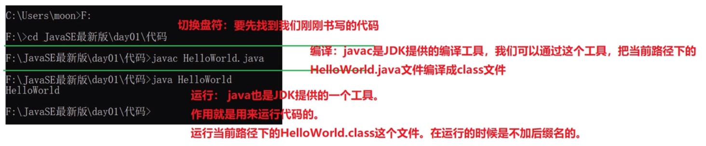

# 入门程序HelloWord

老版本需要先配置环境变量,新版本直接使用

使用Notepad++/记事本编写以下代码保存

```java
public class HelloWorld{
	public static void main(String[] args){
		System.out.println("Hello,World!");
	}
}
```

在文件所在处使用dos命令编译文件

>  javac HelloWorld.java

使用命令运行文件

> java HelloWorld

java11开始支持java直接运行源代码文件

命令

>  java HelloWord.java

底层先生成一个临时的class文件,文件夹不会显示

解释:



三步:

编写程序,编译文件,运行程序


## bug:

识别bug:多看,看自己的代码,看别人的代码

分析bug:多思考,多查资料,

解决bug:多尝试,多总结


## 常见问题


# 注释

单行

多行注释:多数情况下使用多行注释

文档注释:

类的文档注释,类中成员的文档注释,类成员方法的文档注释

有趣的注释:

https://blog.csdn.net/ydk888888/article/details/81563608

在线生成器:

https://www.bootschool.net/chinese-to-ascii

http://patorjk.com/software/taag/#p=display&f=Graffiti&t=Type%20Something%20

http://www.network-science.de/ascii/

```txt
      ##           # # # # ##     
       ###         ### ### #####  
   #    #     #    # # # # #   #  
  ##############   # # # ## ## #  
 ###         ##    # # # # ## ##  
  #          #     ### ### ##  #  
              #    # # # # ## #   
  ##############   # # # # ###### 
        ##         # # # # #   ## 
        ##         ### ###     ## 
        ##         # # # #     ## 
        ##         # # # # ###### 
        ##         # # # ####  ## 
        ##         # # # #     ## 
      ####        #  # # #    ### 
        #         # # # #      #  
```


# 标识符与分隔符

一切起名字的地方,具体包括常量名,变量名,枚举名,方法名,类名,接口名,包名

起名字时需要遵守规则和规范,见名知意原则

命名规则:(参考阿里巴巴开发手册)


# 关键字与保留字

关键字含义

参考:

https://docs.oracle.com/javase/tutorial/java/nutsandbolts/_keywords.html

goto和const作为保留字存在,目前并不使用

# 字面量

数据在程序中的书写格式

字面量不是常量!!!
字面量就是字面值!!!


## 特殊字符


# 常量


# 变量

## 变量的定义格式

变量是程序中最基本的存储单元。包含变量类型、变量名和存储的值

```
数据类型 变量名 = 变量值;
```


## 变量的赋值


## 变量的作用域


## 变量的存储


# 数据类型

## 基本数据类型

四类八种

byte,short,int,long  -->  1,2,4,8

float,double  -->  4,8

char  --> 2

boolean --> true,false

null

float和int都是4个字节,但是范围比long还大为什么?

浮点数的精度问题


## 引用数据类型

类,接口,数组


# 类型转换

## 自动类型提升

byte、short、char --> int --> long --> float --> double

特别的:当byte,short,char类型变量做运算时,结果为int


## 强制类型转换


# 运算符

## 算术运算符


### 一元运算


### 二元运算


## 关系运算符


## 逻辑运算符


## 位运算符


## 三元运算符


# java源代码组织方式

java源文件+包